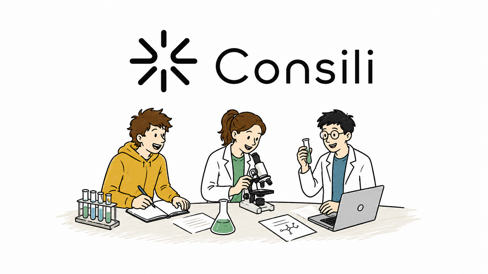

# AI Health Consilium



AI Health Consilium is an open-source biomedical research application that helps researchers, students, clinicians, and health science teams find high-quality research gaps. The app simulates a council of AI scientist agents. Each agent has a different scientific role, searches evidence, critiques the other agents, and contributes to a structured final report.

The goal is not to replace a systematic review, a clinician, or a real research team. The goal is to make early research ideation more rigorous by forcing the system to separate direct evidence from indirect evidence, define PICO elements, identify uncertainty, and produce testable study ideas instead of vague "more research is needed" statements.

Detailed project documentation is in [docs/PROJECT_DOCUMENTATION.md](docs/PROJECT_DOCUMENTATION.md).

Repository: [github.com/davidko119/ai-health-consilium](https://github.com/davidko119/ai-health-consilium)

## Safety Notice

AI Health Consilium is for research and education support only.

It is not medical advice. It must not be used to diagnose, treat, prevent, or manage any health condition. Clinical decisions must be made by qualified human physicians with access to the patient, full clinical history, examination, local standards of care, and appropriate diagnostics.

The application can surface hypotheses and uncertainties, but it can still be wrong. LLM outputs may contain errors, omissions, outdated statements, or overconfident reasoning. Always verify important claims against primary literature, guidelines, and domain experts.

## What The App Does

AI Health Consilium starts with a biomedical research question such as:

```text
Can BDNF modulation improve motor outcomes in adolescent cerebral palsy patients?
```

The app creates a Consilium session and runs a multi-stage research workflow:

1. It extracts a PICO-style interpretation of the question.
2. It asks specialized AI scientist agents to clarify the question.
3. It generates search strategies for PubMed and web sources.
4. It retrieves literature through PubMed E-utilities.
5. It optionally grounds the session with Exa semantic web search and Apify scraping.
6. It tags references by population, intervention, outcomes, species, age relevance, and evidence level.
7. It runs a structured debate among agents.
8. It proposes candidate research gaps.
9. It uses adversarial critique to attack weak, vague, duplicated, or overclaimed gaps.
10. It ranks and diversifies gaps so the top results are not near-duplicates.
11. It writes a final Consilium Report with PICO extraction, evidence map, top gaps, structured study proposals, limitations, and a direct final answer.

## Core Features

| Feature | What it means |
| --- | --- |
| Multi-agent research debate | Five scientist agents reason from different perspectives: clinical, mechanistic, statistical, meta-research, and gap seeking. |
| PICO extraction | The app explicitly identifies population, intervention, comparator, outcomes, context, and mechanistic hypothesis. |
| Evidence directness labels | Claims and gaps are labeled as direct adolescent CP evidence, broader CP evidence, indirect human evidence, preclinical evidence, or mechanistic speculation. |
| PubMed integration | Uses NCBI E-utilities endpoints including `esearch.fcgi`, `esummary.fcgi`, and `efetch.fcgi`. |
| Exa integration | Uses Exa for semantic web search and web grounding when `EXA_API_KEY` is configured. |
| Apify integration | Uses configurable Apify actors for optional scraping when `APIFY_TOKEN` and `APIFY_ACTOR_ID` are configured. |
| OpenRouter LLM gateway | All LLM calls go through OpenRouter chat completions. |
| Convex backend | Convex stores problems, agents, messages, references, gaps, usage logs, PICO extraction, and evidence maps. |
| Gap diversity system | Gap candidates are deduplicated and diversified by gap type before final ranking. |
| Study proposal generation | Each final gap includes objective, population, intervention or exposure, comparator, outcomes, biomarkers, design, and feasibility notes. |
| Usage tracking | OpenRouter usage is logged per problem, including model, token counts, and optional cost metadata. |
| Budget soft limits | The workflow stops gracefully and writes a partial report when configured LLM call or token limits are reached. |
| Dark and light UI | The interface supports dark and light themes. |
| Reusable doctor orchestrator | `lib/doctorOrchestrator.ts` exposes a framework-agnostic `runDoctorConsilium()` helper for cross-model medical research synthesis. |

## Tech Stack

| Layer | Technology |
| --- | --- |
| Frontend | Next.js 16 App Router, React 19, TypeScript |
| Styling | Tailwind CSS 4 |
| Backend and database | Convex |
| LLM gateway | OpenRouter |
| Literature source | PubMed E-utilities |
| Semantic search | Exa |
| Web scraping | Apify |
| Validation | Zod |
| Markdown rendering | react-markdown and remark-gfm |
| Icons | lucide-react |

## Project Structure

```text
ai-health-consilium/
+-- app/                         # Next.js App Router pages and layout
|   +-- page.tsx                 # Home dashboard and problem list
|   +-- new/page.tsx             # New Consilium form
|   +-- problems/[problemId]/    # Main problem detail screen
+-- components/                  # Reusable UI components
|   +-- FinalReport.tsx
|   +-- GapCard.tsx
|   +-- ProblemShell.tsx
|   +-- ReferenceList.tsx
|   +-- ThemeToggle.tsx
+-- config/
|   +-- agents.ts                # Compatibility exports for agent and budget config
|   +-- consilium.ts             # Models, agent templates, prompts, workflow defaults
+-- convex/
|   +-- schema.ts                # Convex database schema
|   +-- problems.ts              # Queries, mutations, internal helpers
|   +-- workflow.ts              # Main multi-agent research pipeline
|   +-- _generated/              # Convex generated API and data model files
+-- docs/
|   +-- PROJECT_DOCUMENTATION.md # Detailed product and technical documentation
+-- lib/
|   +-- apify.ts                 # Apify HTTP client
|   +-- doctorOrchestrator.ts    # Reusable cross-model doctor consilium module
|   +-- exa.ts                   # Exa search client
|   +-- openrouter.ts            # OpenRouter client used by the Convex workflow
|   +-- pubmed.ts                # PubMed E-utilities client
|   +-- researchQuality.ts       # Gap taxonomy, evidence labels, scoring, diversification
+-- public/
|   +-- avatars/                 # Agent avatars
|   +-- consili-banner.png       # README and project banner image
+-- types/
|   +-- consilium.ts             # Shared domain types
|   +-- index.ts                 # Public type exports
+-- LICENSE
+-- package.json
+-- README.md
```

## Main Workflow

The core workflow lives in [convex/workflow.ts](convex/workflow.ts). A session moves through these stages:

```text
draft
  -> clarification
  -> literature
  -> debate
  -> ranking
  -> report
  -> completed
```

If an external API fails, the workflow tries to continue with partial evidence and records an understandable error message in the session. If the LLM budget soft limit is reached, the app generates a partial report instead of crashing.

### Stage 1: Query Understanding

The system extracts:

- Population
- Intervention
- Comparator
- Outcomes
- Context or setting
- Mechanistic hypothesis
- Ambiguous terms

Each PICO field is marked as:

- `explicit`
- `inferred`
- `unclear`

This is important because biomedical research questions often hide assumptions. For example, "BDNF modulation" can mean rehabilitation-induced endogenous BDNF change, non-invasive brain stimulation, pharmacologic modulation, nutrition, regenerative approaches, genetic moderators, or a simple biomarker association.

### Stage 2: Literature Retrieval

The app creates a search plan and retrieves evidence from:

- PubMed through NCBI E-utilities.
- Exa semantic search when `EXA_API_KEY` is configured.
- Apify scraping when `APIFY_TOKEN` and `APIFY_ACTOR_ID` are configured.

References are normalized and saved to the Convex `references` table.

### Stage 3: Evidence Synthesis

The Analyst and Evidence Grader roles separate:

- What is directly supported.
- What is indirectly supported.
- What is preclinical only.
- What is speculative.
- What caveats matter.

### Stage 4: Gap Proposal

The Gap Finder proposes 8 to 12 candidate research gaps. Each gap should include:

- Title
- Description
- Primary gap type
- Optional secondary gap type
- What is known
- What is missing
- Evidence level
- Uncertainty level
- Scores
- Structured study proposal

### Stage 5: Adversarial Critique

The Skeptic / Critic role explicitly attacks:

- Redundancy
- Unsupported animal-to-human extrapolation
- Vague intervention definitions
- Missing comparator
- Weak endpoint definitions
- Duplicated mechanism-only framing
- Claims that sound clinical but are only speculative

### Stage 6: Reranking and Diversification

The final ranking system scores gaps across:

- Novelty
- Evidence scarcity
- Actionability
- Clinical relevance
- Mechanistic importance
- Feasibility
- Distinctiveness

Near-duplicates are penalized. When possible, the top 3 to 5 gaps come from different gap types.

### Stage 7: Final Report

The final report uses this fixed structure:

```text
## Reformulated Clinical/Research Question
## PICO Extraction
## Evidence Map
## Top Research Gaps
## Ranked Study Proposals
## Limitations
## Final Answer
```

## Gap Taxonomy

Every structured gap has exactly one primary type and optionally one secondary type:

| Type | Meaning |
| --- | --- |
| `mechanism` | The biological mechanism is unclear or untested. |
| `intervention` | A specific intervention route has not been tested well enough. |
| `comparator` | Existing studies do not compare against the right control or active comparator. |
| `population_subgroup` | A key subgroup, age range, phenotype, severity level, or genotype is under-studied. |
| `biomarker_measurement` | Biomarkers, endpoints, timing, or measurement validity are weak. |
| `study_design_methodology` | Study design, power, bias control, or reproducibility is weak. |
| `translational` | Evidence exists in another context but has not translated into the target population. |
| `safety_feasibility` | Safety, ethics, adherence, burden, or feasibility are not established. |
| `long_term_outcome` | Durability, long follow-up, participation, or functional impact is missing. |

## Evidence Levels

The app labels evidence directness with these values:

| Evidence level | Meaning |
| --- | --- |
| `direct_human_cp_adolescents` | Direct human evidence in adolescent cerebral palsy. |
| `human_cp_broader_age` | Human evidence in cerebral palsy, but broader or unclear age range. |
| `indirect_human_other_neurological` | Human evidence from other neurological populations. |
| `preclinical_animal` | Animal or preclinical evidence. |
| `mechanistic_speculation` | Mechanistic reasoning without direct supporting evidence. |

## Local Development

### Requirements

- Node.js 20 or newer
- npm
- Convex account
- OpenRouter account and API key for real LLM calls
- Optional: NCBI API key, Exa API key, Apify account

### Install

```bash
npm install
```

### Environment Variables

Create `.env.local` in the project root:

```env
NEXT_PUBLIC_CONVEX_URL=https://your-deployment.convex.cloud

# These are useful for local scripts, but Convex actions should receive
# server-side secrets through `npx convex env set`.
OPENROUTER_API_KEY=sk-or-...
NCBI_API_KEY=your_ncbi_key
NCBI_EMAIL=you@example.com
EXA_API_KEY=your_exa_key
APIFY_TOKEN=apify_api_...
APIFY_ACTOR_ID=apify/website-content-crawler
APIFY_ACTOR_INPUT_JSON=
```

Set Convex server-side secrets:

```bash
npx convex env set OPENROUTER_API_KEY "sk-or-..."
npx convex env set NCBI_API_KEY "your_ncbi_key"
npx convex env set NCBI_EMAIL "you@example.com"
npx convex env set EXA_API_KEY "your_exa_key"
npx convex env set APIFY_TOKEN "apify_api_..."
npx convex env set APIFY_ACTOR_ID "apify/website-content-crawler"
```

`APIFY_ACTOR_INPUT_JSON` is optional. Leave it empty for `apify/website-content-crawler` because the app can pass `startUrls` from Exa results. For search-style actors, use a JSON template such as:

```json
{"query":"{{query}}","maxItems":{{maxItems}}}
```

For crawler-style actors:

```json
{"startUrls":{{startUrls}},"maxCrawlPages":{{maxItems}},"proxyConfiguration":{"useApifyProxy":true}}
```

The exact fields depend on the chosen Apify actor. Copy the required input shape from the actor page in Apify Console.

### Start Convex

```bash
npx convex dev
```

This syncs the schema and creates the generated Convex files under `convex/_generated/`. If Next.js reports that `convex/_generated/api.ts` is missing, run `npx convex dev` or `npx convex codegen`.

### Start Next.js

```bash
npm run dev
```

Open [http://localhost:3000](http://localhost:3000).

## Verification Commands

```bash
npm run lint
npm run typecheck
npm run build
```

## Important Configuration Files

### `config/consilium.ts`

Controls:

- Default LLM model
- Evaluator model
- Temperature
- Max tokens
- Debate rounds
- Max PubMed and web queries
- Max references in prompts
- Per-problem LLM call and token soft limits
- Agent role templates
- Guardrail prompts
- Domain-specific rules
- Required final report structure

### `lib/researchQuality.ts`

Contains:

- Gap type labels
- Evidence level labels
- Gap type normalization
- Evidence level normalization
- Lexical similarity for duplicate detection
- Diversified ranking logic
- Vagueness penalties
- Evidence directness penalties

### `lib/doctorOrchestrator.ts`

Exports a reusable framework-agnostic function:

```ts
runDoctorConsilium(caseInput: DoctorCaseInput): Promise<DoctorAnswer>
```

It calls multiple OpenRouter models in parallel, runs cross-model critique, and asks a final judge model to produce one careful research-oriented answer with a safety disclaimer.

## Adding A New Agent

Edit `DEFAULT_AGENT_TEMPLATES` in `config/consilium.ts`:

```ts
{
  name: "Health Economist",
  roleDescription:
    "You are a health economist focused on cost-effectiveness, resource allocation, and implementation barriers.",
  specializationTags: ["cost-effectiveness", "implementation", "HTA"],
  model: "openai/gpt-4o-mini",
  temperature: 0.25
}
```

Future Consilium sessions will instantiate the new role.

## Adding A New Data Source

1. Add a typed client under `lib/`.
2. Normalize results to the same reference shape used by the Convex `references` table.
3. Add collection logic in `convex/workflow.ts`.
4. Tag references with `ReferenceEvidenceProfile`.
5. Update this README and [docs/PROJECT_DOCUMENTATION.md](docs/PROJECT_DOCUMENTATION.md).

## Deployment Notes

Typical deployment path:

1. Deploy Convex and set Convex environment variables.
2. Deploy the Next.js frontend to Vercel or another Next-compatible platform.
3. Set `NEXT_PUBLIC_CONVEX_URL` in the frontend host.
4. Keep `OPENROUTER_API_KEY`, `EXA_API_KEY`, `APIFY_TOKEN`, and `NCBI_API_KEY` server-side.
5. Run `npm run build` before publishing.

## Known Limitations

- The app does not replace a systematic review.
- PubMed abstracts may be incomplete and full text is not always available.
- Retrieved web sources depend on Exa and Apify configuration.
- LLMs may still hallucinate, omit evidence, or misclassify study designs.
- Similarity deduplication is lexical and heuristic, not a full embedding-based semantic duplicate system.
- Cost estimates depend on what OpenRouter returns; model prices are intentionally not hard-coded.
- The default demo session model configuration favors cost control over maximum reasoning depth.

## Roadmap

- User authentication and private workspaces
- PDF export of final reports
- Public share links for completed Consilium sessions
- Upload-your-own-paper workflow
- Embedding-based semantic deduplication
- Semantic Scholar integration
- ClinicalTrials.gov integration
- Custom agent builder in the UI
- Background notifications when a session completes
- More detailed usage and cost dashboards

## Contributing

Pull requests are welcome. For large changes, open an issue first so the direction can be discussed.

Suggested flow:

```bash
git checkout -b feature/my-change
npm run lint
npm run typecheck
npm run build
git commit -m "Describe the change"
git push origin feature/my-change
```

## License

MIT. See [LICENSE](LICENSE).

## Acknowledgements

- [OpenRouter](https://openrouter.ai) for unified LLM access.
- [Convex](https://convex.dev) for reactive backend and database.
- [NCBI / PubMed](https://pubmed.ncbi.nlm.nih.gov) for biomedical literature APIs.
- [Exa](https://exa.ai) for semantic web search.
- [Apify](https://apify.com) for web scraping infrastructure.

Built by [David Sarlak](https://github.com/davidko119).
